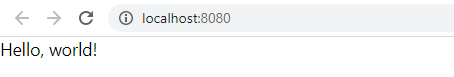
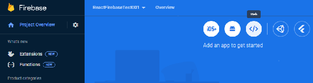

# React native example with web 
 - this project uses : **react-native** and **react-native-web** components;
 - this project is in development, I set only the web to running well;
 - for android and iOS is no set yet;

## settings for basic react-native integration

 - install react-native and create a new project named 'ReactFirebaseTest001' :

  ```npx react-native@latest init ReactFirebaseTest001
  Need to install the following packages:
    react-native@0.71.8
  Ok to proceed? (y) y
  npm WARN deprecated source-map-url@0.4.1: See https://github.com/lydell/source-map-url#deprecated
  npm WARN deprecated urix@0.1.0: Please see https://github.com/lydell/urix#deprecated
  npm WARN deprecated source-map-resolve@0.5.3: See https://github.com/lydell/source-map-resolve#deprecated
  npm WARN deprecated resolve-url@0.2.1: https://github.com/lydell/resolve-url#deprecated
  npm WARN deprecated uglify-es@3.3.9: support for ECMAScript is superseded by `uglify-js` as of v3.13.0

                ######                ######
              ###     ####        ####     ###
              ##          ###    ###          ##
              ##             ####             ##
              ##             ####             ##
              ##           ##    ##           ##
              ##         ###      ###         ##
              ##  ########################  ##
            ######    ###            ###    ######
        ###     ##    ##              ##    ##     ###
    ###         ## ###      ####      ### ##         ###
    ##           ####      ########      ####           ##
  ##             ###     ##########     ###             ##
    ##           ####      ########      ####           ##
    ###         ## ###      ####      ### ##         ###
        ###     ##    ##              ##    ##     ###
            ######    ###            ###    ######
              ##  ########################  ##
              ##         ###      ###         ##
              ##           ##    ##           ##
              ##             ####             ##
              ##             ####             ##
              ##          ###    ###          ##
              ###     ####        ####     ###
                ######                ######


                    Welcome to React Native!
                  Learn once, write anywhere

  √ Downloading template
  √ Copying template
  √ Processing template
  √ Installing dependencies


    Run instructions for Android:
      • Have an Android emulator running (quickest way to get started), or a device connected.
      • cd "F:\ReactFirebaseTest001" && npx react-native run-android

    Run instructions for Windows:
      • See https://aka.ms/ReactNativeGuideWindows for the latest up-to-date instructions.
  ```

 - install react-native-cli

  ```cd ReactFirebaseTest001

  ReactFirebaseTest001>npm i react-native-cli

  added 39 packages, and audited 1311 packages in 7s

  131 packages are looking for funding
    run `npm fund` for details

  found 0 vulnerabilities```

  - test command for android  - is not set in my project and this is result :

  npm run android 

  > ReactFirebaseTest001@0.0.1 android
  > react-native run-android

  (node:14976) Warning: Accessing non-existent property 'padLevels' of module exports inside circular dependency
  (Use `node --trace-warnings ...` to show where the warning was created)
  info Starting JS server...
  '"adb"' is not recognized as an internal or external command,
  operable program or batch file.
  info Launching emulator...
  error Failed to launch emulator. Reason: No emulators found as an output of `emulator -list-avds`.
  warn Please launch an emulator manually or connect a device. Otherwise app may fail to launch.
  info Installing the app...

  ERROR: JAVA_HOME is not set and no 'java' command could be found in your PATH.

  Please set the JAVA_HOME variable in your environment to match the
  location of your Java installation.

  error Failed to install the app. Make sure you have the Android development environment set up: https://reactnative.dev/docs/environment-setup.
  Error: Command failed: gradlew.bat app:installDebug -PreactNativeDevServerPort=8081
  ...
                                      
                          ▒▒▓▓▓▓▒▒
                      ▒▓▓▓▒▒░░▒▒▓▓▓▒
                    ▒▓▓▓▓░░░▒▒▒▒░░░▓▓▓▓▒
                  ▓▓▒▒▒▓▓▓▓▓▓▓▓▓▓▓▓▒▒▒▓▓
                  ▓▓░░░░░▒▓▓▓▓▓▓▒░░░░░▓▓
                  ▓▓░░▓▓▒░░░▒▒░░░▒▓▒░░▓▓
                  ▓▓░░▓▓▓▓▓▒▒▒▒▓▓▓▓▒░░▓▓
                  ▓▓░░▓▓▓▓▓▓▓▓▓▓▓▓▓▒░░▓▓
                  ▓▓▒░░▒▒▓▓▓▓▓▓▓▓▒░░░▒▓▓
                    ▒▓▓▓▒░░░▒▓▓▒░░░▒▓▓▓▒
                      ▒▓▓▓▒░░░░▒▓▓▓▒
                          ▒▒▓▓▓▓▒▒


                  Welcome to Metro v0.73.9
                Fast - Scalable - Integrated

  r - reload the app
  d - open developer menu
  i - run on iOS
  a - run on Android

  ```
  ## start android - not work need to set with Android Studio 
  ```npx react-native run-android```

  ## React native web 

  - for react native web use this command :

  ```npm install react-native-web react-dom```

  ```npm install --save-dev @types/react-dom```

  ```npm install react-scripts --save-dev```

  ```npm install --save-dev typescript @types/react @types/react-native```

  ```npm install --save-dev ts-loader```

  ```npm install --save-dev babel-loader @babel/core @babel/preset-env @babel/preset-react```

  - for new npm version use 'add' :

  ```npm add --dev webpack webpack-cli webpack-dev-server```

  ```npm add --dev html-webpack-plugin ts-loader```
  
  
  - create a folder 'public'

  - add index.html to the folder 'public' because will run the 'bundle.js'

  - fill the index.html with this source code:

  ```<!DOCTYPE html>
      <html>
        <head>
          <meta charset="utf-8">
          <title>React Firebase Test</title>
        </head>
        <body>
          <div id="root"></div>
          <script src="bundle.js"></script>
        </body>
      </html>
  
  ```

  - in fisierul modifica 'metro.config.js' :

  ```module.exports = {
      resolver: {
        platforms: ['web', 'ios', 'android'],
      },
      transformer: {
        getTransformOptions: async () => ({
          transform: {
            experimentalImportSupport: false,
            inlineRequires: true,
          },
        }),
      },
    };```

  - in fisierul 'package.json' adauga optiunea pentru wen : 

  ```"scripts": {
      "android": "react-native run-android",
      "ios": "react-native run-ios",
      "lint": "eslint .",
      "start": "react-native start",
      "web": "webpack-dev-server",
      "test": "jest"
    },```

  ## running web server

  ```npm run web 

  > ReactFirebaseTest001@0.0.1 web
  > webpack-dev-server

  <i> [webpack-dev-server] Project is running at:
  <i> [webpack-dev-server] Loopback: http://localhost:8080/
  <i> [webpack-dev-server] On Your Network (IPv4): http://192.168.0.248:8080/
  <i> [webpack-dev-server] Content not from webpack is served from 'F:\ReactFirebaseTest001\public' directory
  <i> [webpack-dev-server] 404s will fallback to '/index.html'
  <i> [webpack-dev-middleware] wait until bundle finished: /
  <i> [webpack-dev-middleware] wait until bundle finished: /
  asset bundle.js 1.73 MiB [emitted] (name: main)
  310 modules
  webpack 5.83.1 compiled successfully in 10403 ms
  
  ```

 - this is the resut of the running bundle

 

## Use with firebase 

 - create a firebase project on https://console.firebase.google.com .

 - install the firebase in NodeJS for Firebase: 

 ```npm add @react-native-firebase/app```

 - if you want to use web server with firebase then you need to select this option :

